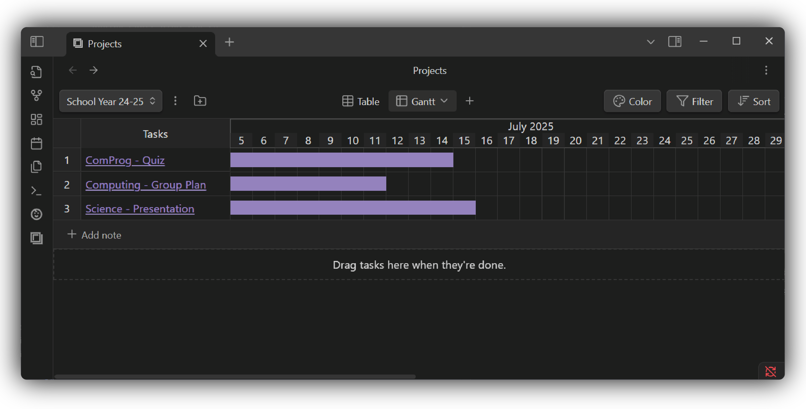

[![Contributors][contributors-shield]][contributors-url]
[![Forks][forks-shield]][forks-url]
[![Stargazers][stars-shield]][stars-url]
[![Issues][issues-shield]][issues-url]
[![License][license-shield]][license-url]

<!-- [![LinkedIn][linkedin-shield]][linkedin-url] -->

 

  <h3 style="font-size: 1.5em" align="center">A fork of</h3>  
<picture>
  <source media="(prefers-color-scheme: dark)" srcset="https://raw.githubusercontent.com/marcusolsson/obsidian-projects/main/images/dark.svg">
  <source media="(prefers-color-scheme: light)" srcset="https://raw.githubusercontent.com/marcusolsson/obsidian-projects/main/images/light.svg">
  
</picture>

  

     
    adding Gantt view for <a href="https://github.com/marcusolsson/obsidian-projects">Obdisian Projects</a>
     
    <a href="https://github.com/Deadbush225/obsidian-projects#Demo">View Demo</a>
    &middot;
    <a href="https://github.com/Deadbush225/obsidian-projects/issues/new?labels=bug&template=bug-report---.md">Report Bug</a>
    &middot;
    <a href="https://github.com/Deadbush225/obsidian-projects/issues/new?labels=enhancement&template=feature-request---.md">Request Feature</a>
  

## About The Project

Visualize your projects using the power of gantt charts.

### Demo:

</img>

### Features

💬 Start and End Dates  
👆 Drag notes when finished  

## Installation:

### Requirements:

- [x] [BRAT plugin](https://github.com/TfTHacker/obsidian42-brat)

> [!Note]  
> You must turn off **Restricted mode** to use Projects.

**Installing BRAT** 

1. Open **Settings**.  
2. Under **Community plugins**, select **Browse**.  
3. Search for "Projects" by Marcus Olsson, and then select it. 
4. Select **Install**.

### Installation:

**Using BRAT to install Gantt View:**

1. Open **Settings**.  
2. Under **Community plugins**, select **BRAT**.  
3. Select **Add Beta Plugins**.
4. Enter "Deadbush225/obsidian-projects" for the GitHub repository.
5. Select **Add Plugin**.

## Usage:

To get started using Projects, press **Ctrl+P** (or **Cmd+P** on macOS) to open the **Command palette**, and then select **Projects: Show projects**.

## License

Projects is distributed under [Apache License 2.0](LICENSE).

If you have any questions, or want to stay updated, join our [Discussions](https://github.com/marcusolsson/obsidian-projects/discussions).

<!-- MARKDOWN LINKS & IMAGES -->
<!-- https://www.markdownguide.org/basic-syntax/#reference-style-links -->

[contributors-shield]: https://img.shields.io/github/contributors/Deadbush225/obsidian-projects?style=for-the-badge
[contributors-url]: https://github.com/Deadbush225/obsidian-projects/graphs/contributors
[forks-shield]: https://img.shields.io/github/forks/Deadbush225/obsidian-projects?style=for-the-badge
[forks-url]: https://github.com/Deadbush225/obsidian-projects/forks
[stars-shield]: https://img.shields.io/github/stars/Deadbush225/obsidian-projects?style=for-the-badge
[stars-url]: https://github.com/Deadbush225/obsidian-projects/stargazers
[issues-shield]: https://img.shields.io/github/issues/Deadbush225/obsidian-projects?style=for-the-badge
[issues-url]: https://github.com/Deadbush225/obsidian-projects/issues
[license-shield]: https://img.shields.io/github/license/Deadbush225/obsidian-projects?style=for-the-badge
[license-url]: https://github.com/Deadbush225/obsidian-projects/blob/master/LICENSE.txt
[linkedin-shield]: https://img.shields.io/badge/-LinkedIn-black.svg?style=for-the-badge&logo=linkedin&colorB=555
[linkedin-url]: https://www.linkedin.com/in/eliazar-inso-0342b7210/
[product-screenshot]: images/screenshot.png
